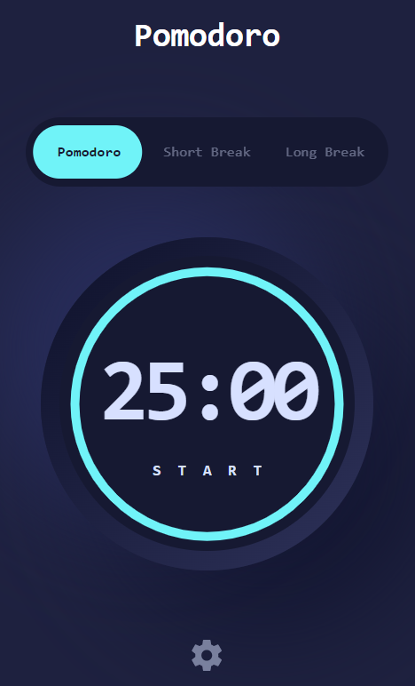
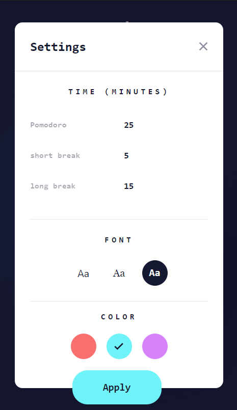
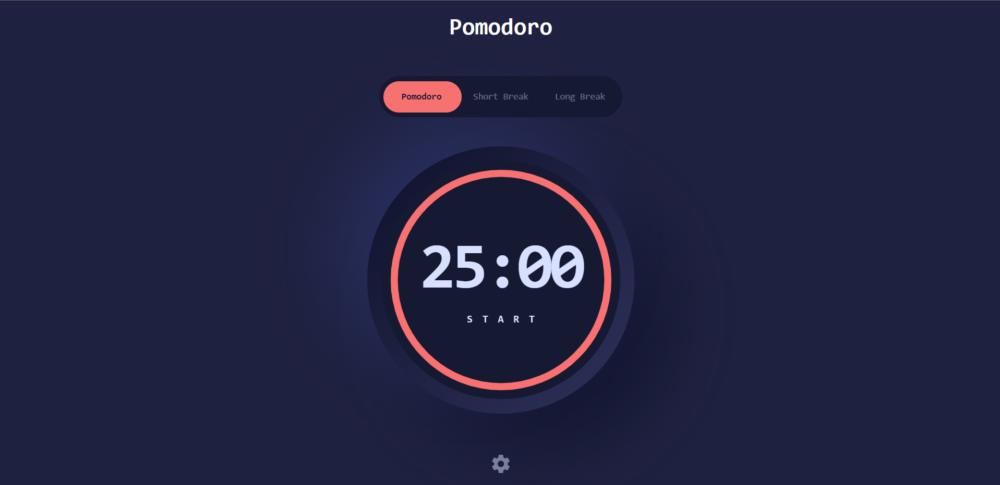
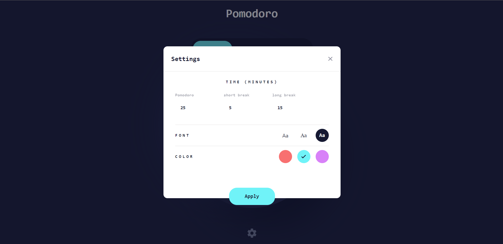

# Frontend Mentor - Pomodoro App

This is a solution to the [Pomodoro App](https://www.frontendmentor.io/challenges/pomodoro-app-KBFnycJ6G).This project was developed in React, it is a Frontend Mentor challenge, This Pomodoro app will provide some tricky challenges, including building a circular progress bar. You'll also build a range of customizations, like colors and fonts.

## 🧐 What's inside?

This Starter includes

- ⚛️ [React 18](https://reactjs.org/) - A JavaScript library for building user interfaces
- ✨ [TypeScript](https://www.typescriptlang.org/) - TypeScript is a strongly typed programming language that builds on JavaScript, giving you better tooling at any scale.
- 🎉 [Sass](https://sass-lang.com/) - Sass is the most mature, stable, and powerful professional grade CSS extension language in the world.


## Overview

## 🚀 Getting Started

```
# Install dependencies

npm install
# or
yarn install

# Start development server

yarn dev
# or
npm run dev

# Build for production

yarn build
# or
npm run build
```

### The challenge

Users should be able to:
- Set a Pomodoro timer and short & long break timers.

- Customize how long each timer runs for.

- See a circular progress bar that updates every minute and represents how far through their timer they are.

- Customize the appearance of the app with the ability to set preferences for colors and fonts.

### Screenshot









### Links

- Solution URL: [Link to solution URL here](https://www.frontendmentor.io/solutions/pomodoro-app-Prwcahk78f)
- Live Site URL: [Link to live site](https://pomodoro-gb.netlify.app/)

## Author

- Frontend Mentor - [@Georgeb79](https://www.frontendmentor.io/profile/Georgeb779)
- Linkedin - [@GeorgeBaez](https://www.linkedin.com/in/george-baez/)
- Twitter - [@Georgeb779](https://twitter.com/Georgeb779)
